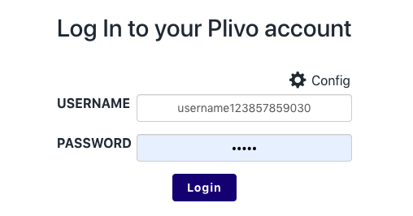

## Plivo Browser SDK v2.1 Example
*This Plivo example shows how to use all the features in Plivo Browser SDK 2.1 using a simple webphone demo. This demo helps in making phone calls from web browser to both sip addresses and PSTN phone numbers without installing any plugins.*


---
*To use the [live web phone demo](https://s3.amazonaws.com/plivobrowsersdk/v2/example.html)*

*a. Sign up for a Plivo account here: https://console.plivo.com/accounts/register/*

*b. Create a Plivo Endpoint here: https://console.plivo.com/voice/endpoints/add/*

*c. Use this Plivo endpoint to login after deploying the application*

---
### Deploying the application

```
git clone https://github.com/plivo/plivo-browser-sdk2-examples.git
npm install
npm start
```

### Initialization
Include 
```js
<script type="text/javascript" src="https://cdn.plivo.com/sdk/browser/v2/plivo.min.js"></script>
```
in the `<body>` tag before you include other javascript files dependent on the SDK. 

Lets create a `customclient.js` file and declare a variable `var plivoBrowserSdk;`
This is where we initialise a new Plivo object by passing `options` as `plivoBrowserSdk = new window.Plivo(options);`. The application can set up listeners for events as shown in the `initPhone` function below. 

```js
var plivoBrowserSdk; 
function initPhone(username, password){
  var options = refreshSettings();
  plivoBrowserSdk = new window.Plivo(options);

  
  plivoBrowserSdk.client.on('onWebrtcNotSupported', onWebrtcNotSupported);
  plivoBrowserSdk.client.on('onLogin', onLogin);
  plivoBrowserSdk.client.on('onLogout', onLogout);
  plivoBrowserSdk.client.on('onLoginFailed', onLoginFailed);
  plivoBrowserSdk.client.on('onCallRemoteRinging', onCallRemoteRinging);
  plivoBrowserSdk.client.on('onIncomingCallCanceled', onIncomingCallCanceled);
  plivoBrowserSdk.client.on('onCallFailed', onCallFailed);
  plivoBrowserSdk.client.on('onCallAnswered', onCallAnswered);
  plivoBrowserSdk.client.on('onCallTerminated', onCallTerminated);
  plivoBrowserSdk.client.on('onCalling', onCalling);
  plivoBrowserSdk.client.on('onIncomingCall', onIncomingCall);
  plivoBrowserSdk.client.on('onMediaPermission', onMediaPermission);
  plivoBrowserSdk.client.on('mediaMetrics',mediaMetrics);
  plivoBrowserSdk.client.on('audioDeviceChange',audioDeviceChange);
  plivoBrowserSdk.client.on('onConnectionChange', onConnectionChange);
  plivoBrowserSdk.client.on('volume', volume);
  plivoBrowserSdk.client.setRingTone(true);
  plivoBrowserSdk.client.setRingToneBack(true);
  console.log('initPhone ready!')
}
```
In the demo, `options` can be set from UI in the CONFIG menu. Once the CONFIG is updated clicking on LOGIN will boot the phone again.

### Document ready state

>If you're directly calling login on page load, please make sure you do that only after HTML document ready. 

```html
  <script type="text/javascript">
    $(document).ready(function() {
      console.log("HTML ready!");
      resetSettings(); // Optional, reset your Plivo settings on page load
      initPhone(); // Optional, Initialise Plivo sdk instance on load
    }); 
  </script>
```
### Login 

```js
function login(username, password) {
  if(username && password) {
    //start UI load spinner
    kickStartNow();     
    plivoBrowserSdk.client.login(username, password);
  } else {
    console.error('username/password missing!')
  }
}

$('#clickLogin').click(function(e){
  var userName = $('#loginUser').val();
  var password = $('#loginPwd').val();
  login(userName, password);
});
```

### Options
*Options allow to disable tracking, setting codec type, enabling and disabling AEC/AGC etc. The list of all the settings can be found in the documentation page.*


```js
var defaultSettings = { "debug":"DEBUG", "permOnClick":true, "codecs":["OPUS","PCMU"], "enableIPV6":false, "audioConstraints":{"optional":[{"googAutoGainControl":false}, {"googEchoCancellation":false}]}, "enableTracking":true, "closeProtection":false, "maxAverageBitrate":48000}
function resetSettings(){
  document.getElementById('loglevelbtn').value = "INFO"
  document.getElementById('onpageload').checked = true
  document.getElementById('monitorquality').checked = true
  document.getElementById('dontcloseprotect').checked = true
  document.getElementById('allowdscp').checked = true
  document.getElementById('noincoming').checked = true
  document.getElementById('msregionbtn').value = "AUTO"
  document.getElementById('averagebitrate').value = 48000
  localStorage.setItem('plivosettings',JSON.stringify(defaultSettings));
}

function updateSettings(val){
  let loglevel = document.getElementById('loglevelbtn').value;
  val.debug = loglevel;
  changeVal(val, document.getElementById('onpageload').checked, 'permOnClick', true);
  changeVal(val, document.getElementById('monitorquality').checked, "enableTracking", false);
  changeVal(val, document.getElementById('dontcloseprotect').checked, "closeProtection", true);
  changeVal(val, document.getElementById('allowdscp').checked, "dscp", false);
  changeVal(val, document.getElementById('noincoming').checked, "allowMultipleIncomingCalls", true);
  let clientRegion = document.getElementById('msregionbtn').value;
  if(clientRegion!='AUTO') {
    val.clientRegion = clientRegion;
  }
  let averagebitrate = document.getElementById('averagebitrate').value;
  val.maxAverageBitrate = parseInt(averagebitrate);
  localStorage.setItem('plivosettings',JSON.stringify(val));
  console.log('plivosettings updated!')
}
// From UI triggers
$('#updateSettings').click(function(e){
  updateSettings(defaultSettings);
});

$('#resetSettings').click(function(e){
  resetSettings();
}); 
```  
### Registration
The following snippet shows how to handle registration related events in the application
```js
function onReady(){
  $('#phonestatus').html('trying to login...');
  console.info('Ready');
}

function onLogin(){
  $('#phonestatus').html('online');
  console.info('Logged in');
  $('#makecall').attr('class', 'btn btn-success btn-block flatbtn');
  $('#loginContainer').hide();
  $('#callContainer').show();
}

function onLoginFailed(reason){
  console.info('onLoginFailed ',reason);
  customAlert('Login failure :',reason, 'warn');  
}

function onLogout(){
  console.info('onLogout');
  $('#loginContainer').show();
  $('#callContainer').hide();
}
```  
### Outgoing call
Given a number or SIP URI, this snippet shows how to make an outgoing call. The following snippet takes input from the dial pad UI. 
```js
$('#makecall').click(function(e){
  var to = $('#toNumber').val().replace(" ","");
  var callEnabled = $('#makecall').attr('class').match('disabled');
  if(!to || !plivoBrowserSdk || !!callEnabled){return};
  console.info('Click make call : ',to);
  plivoBrowserSdk.client.call(to);
  $('.phone').hide();
  $('.AfterAnswer').show();
  $('#boundType').html('Outgoing : '+to);
  $('#callDuration').html('00:00:00');
  $('.callinfo').show();
});
```
#### Outgoing call with dynamic caller ID
There are cases where you need to set different caller ID for each campaign or some different reasons, then you can start using extraHeaders in   `.call()` method
```js
$('#makecall').click(function(e){
  var to = $('#toNumber').val();
  // pass caller Id
  var extraHeaders={},
  customCallerId = localStorage.getItem('callerId'); // get the dynamic caller id
  if(customCallerId) {
    extraHeaders = {'X-PH-callerId': customCallerId};
  }
  console.info('Click make call : ',to);
  plivoBrowserSdk.client.call(to, extraHeaders);
});
```
Capture this extraHeader in application side and use `callerId` attribute to set the callerId in [Dial](https://www.plivo.com/docs/xml/dial/) Element


### Handling Incoming calls
By creating the `onIncomingCall` listener, the `plivoBrowserSdk` object can handle incoming calls to the Plivo Endpoint.

```js
function onIncomingCall(callerName, extraHeaders){
  console.info(callerName, extraHeaders);
  $('#boundType').html('Incomming :');
  $('#callNum').html(callerName);
  $('#callDuration').html('00:00:00');
  $('.callinfo').show();
  $('.callScreen').show();
  $('.inboundBeforeAnswer').show();
}
function onIncomingCallCanceled(){
  console.info('onIncomingCallCanceled');
  callOff();
}
```
The following snippet shows how to answer an incoming call
```js
$('.answerIncoming').click(function(){
  console.info('Call accept clicked');
  plivoBrowserSdk.client.answer();
  $('.incomingCallDefault').hide();
  $('.callinfo').show();
});
```
The following snippet shows how to reject an incoming call
```js
$('.rejectIncoming').click(function(){
  console.info('Call rejected');
  plivoBrowserSdk.client.reject();
  $('.incomingCallDefault').hide();
});
```
The following snippet shows how to ignore an incoming call
```js
$('.ignoreIncoming').click(function(){
  console.info('Call ignored');
  plivoBrowserSdk.client.ignore();
  $('.incomingCallDefault').hide();
});
```
### Terminating a call
This code may be used to terminate a call. 
```js
$('.hangup').click(function(){
  console.info('Hangup');
  if(plivoBrowserSdk.client.callSession) {
    plivoBrowserSdk.client.hangup();
  }else {
    callOff();
  }
}); 
```
### Implementing MediaMetrics

This snippet shows how to handle network or media related events from the SDK. A simple dynamic UI to show notifications when some warning events get emitted from Plivo SDK


Please check Chrome or Firefox console to see the complete info of the event. 
```js
function mediaMetrics(obj){
  console.table([obj]); 
  $(".alertmsg").prepend(
  '<div class="metrics -'+obj.type+'">' +
  '<span style="margin-left:20px;">'+obj.level+' | </span>' +
  '<span style="margin-left:20px;">'+obj.group+' | </span>' +
  '<span style="margin-left:20px;">'+message+' - '+obj.desc+' : </span><span >'+obj.value+'</span>'+
  '<span aria-hidden="true" onclick="closeMetrics(this)" style="margin-left:25px;cursor:pointer;">X</span>' +
  '</div>'
  );
}
```

### Audio Device API

The Audio Device API in this SDK allows developers to select input, output and ring devices for the calls.


The following snippet uses this API to demonstrate how to handle device selection from the UI 

```js
// Audio device selection
$('#micDev').change(function(){
  var selectDev = $('#micDev').val();
  plivoBrowserSdk.client.audio.microphoneDevices.set(selectDev);
  console.debug('Microphone device set to : ',selectDev);
});

$('#speakerDev').change(function(){
  var selectDev = $('#speakerDev').val();
  plivoBrowserSdk.client.audio.speakerDevices.set(selectDev);
  console.debug('Speaker device set to : ',selectDev);
});

$('#ringtoneDev').change(function(){
  var selectDev = $('#ringtoneDev').val();
  plivoBrowserSdk.client.audio.ringtoneDevices.set(selectDev);
  console.debug('Ringtone dev set to : ',selectDev);
});
```

The following snippet uses this API and demonstrates the use case of testing audio devices

```js
// Ringtone device test
$('#ringtoneDevTest').click(function(){
  let ringtoneVal = document.getElementById('ringtoneDevTest').innerText;
  // Toggle Test
  if(ringtoneVal=='Test') {
    showOuputAudioLevel('ringoutput');
    $('#ringtoneDevTest').html('Stop');
  } else if(ringtoneVal=='Stop') {
    stopOutputAudioLevel('ringoutput');
    $('#ringtoneDevTest').html('Test');
  }
});

// Speaker device test
$('#speakerDevTest').click(function(){
  let speakerVal = document.getElementById('speakerDevTest').innerText;
  // Toggle Test
  if(speakerVal=='Test') {
    showOuputAudioLevel('speakeroutput');
    $('#speakerDevTest').html('Stop');
  } else if(speakerVal=='Stop') {
    stopOutputAudioLevel('speakeroutput');
    $('#speakerDevTest').html('Test');
  }
});
```

The following snippet uses this API to retrieve available devices and populate them in UI

```js
function updateAudioDevices(){
  // Remove existing options if any
  document.querySelectorAll('#micDev option').forEach(e=>e.remove())
  document.querySelectorAll('#ringtoneDev option').forEach(e=>e.remove())
  plivoBrowserSdk.client.audio.availableDevices()
  .then(function(e){
  e.forEach(function(dev){
    if(dev.label && dev.kind == "audioinput")
    $('#micDev').append('<option value='+dev.deviceId+'>'+dev.label+'</option>')
    if(dev.label && dev.kind == "audiooutput"){
    $('#ringtoneDev').append('<option value='+dev.deviceId+'>'+dev.label+'</option>');
    $('#speakerDev').append('<option value='+dev.deviceId+'>'+dev.label+'</option>')  
    }
  });
  })
  .catch(function(error){
  console.error(error);
  })
}

//revealAudioDevices
$('#allowAudioDevices').click(function(){
  refreshAudioDevices();
});

function refreshAudioDevices() {
  _forEach.call(document.querySelectorAll('#popAudioDevices option'), e=>e.remove());
  plivoBrowserSdk.client.audio.revealAudioDevices()
  .then(function(e){
    updateAudioDevices();
    console.log('Media permission ',e)
  })
  .catch(function(error){
    console.error('media permission error :',error);
    $('#mediaAccessBlock').modal('show');
  })
}
```
### Audio Device change
Show users about change in audio device, either added or removed.
When a new device gets added they can select the device for either input or output audio.


```js
function audioDeviceChange(e){
  console.log('audioDeviceChange',e);
  if(e.change){
    if(e.change == "added") {
      customAlert(e.change,e.device.kind +" - "+e.device.label,'info');   
    }else {
      customAlert(e.change,e.device.kind +" - "+e.device.label,'warn');
    }
  }else {
    customAlert('info','There is an audioDeviceChange but mediaPermission is not allowed yet');
  }
}
```
### Sending Feedback
The following snippet shows how to collect feedback using the SDK. There is a predefined list of feedback comments that users can select for the score range from 1-3. In this application we are taking “good” and “perfect” as feedback for scores 4 and 5.


```js
$('#sendFeedback').click(function(){
  var score = $('#stars li.selected').last().data('value');
  score = Number(score);
  var lastCallid = plivoBrowserSdk.client.getLastCallUUID();
  var issues=[];
  _forEach.call(document.querySelectorAll('[name="callqualitycheck"]'), e=>{
    if(e.checked) {
      issues.push(e.value);
    }
  });
  var note = sendFeedbackComment.value;
  var sendConsoleLogs = document.getElementById("sendConsoleLogs").checked;
  // submitCallQualityFeedback takes parameteres callUUId, starRating, issues, note, sendConsoleLogs
  plivoBrowserSdk.client.submitCallQualityFeedback(lastCallid, score, issues, note, sendConsoleLogs)
  .then((result) => {
    $('#feedbackStatus').html('Feedback sent');
    $('#ignoreFeedback').click();
    customAlert('Feedback sent','','info');
    $('.lowQualityRadios').hide();
  })
  .catch((error) => {
    $('#feedbackStatus').html(error);
    customAlert('Could not send feedback','','warn');
  });
});
```
### Real-time volume indicator on UI
Display user real-time volume of mic and speaker.
'volume' event handler will be invoked 60 times per second. The handler receives inputVolume and outputVolume as percentages of maximum volume represented by a floating point number between 0.0 and 1.0, inclusive. This value represents a range of relative decibel values between -100dB and -30dB.


```js
function volume(audioStats){
  inputVolume = audioStats.inputVolume;
  outputVolume =  audioStats.outputVolume;
  colorPids(Math.floor(inputVolume * 325), 'localaudio');
  colorPids(Math.floor(outputVolume * 325), 'remoteaudio');
}
```
